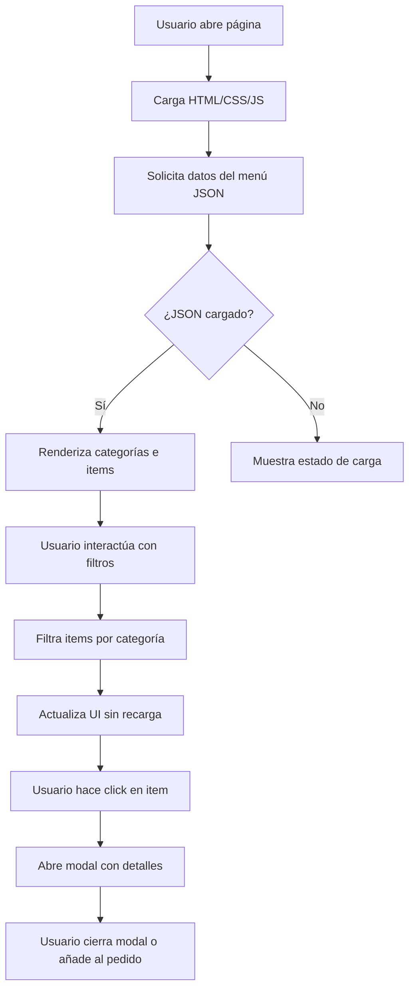

# Plan Arquitectónico - Menú Web "OYE BONITA - La Casa del Vallenato"

## 1. ANÁLISIS DEL ESTADO ACTUAL

### 1.1. Estructura Existente
- **HTML**: Estructura semántica básica con header, hero, menú placeholder y footer
- **CSS**: Variables CSS con paleta colombiana (rojo, azul, naranja, verde)
- **JavaScript**: Funcionalidades básicas (scroll suave, placeholder para menú móvil)
- **Assets**: Carpeta vacía para imágenes y recursos

### 1.2. Desalineaciones con Requerimientos
1. **Paleta de colores**: Actual usa rojo vibrante (#E63946) y azul profundo, pero el requerimiento es fondo negro (#101010) con acentos dorados (#D4AF37)
2. **Temática visual**: Falta incorporar elementos vallenatos (acordeón, maracas, botella de aguardiente, sombrero vueltiao)
3. **Secciones del menú**: Solo hay categorías genéricas, no las específicas (Entradas, Hamburguesas, Para Picar, Licores, Cócteles)
4. **Tipografía**: Actual usa Poppins y Montserrat, pero se requiere script elegante para logo y serif elegante para subtítulos
5. **Efectos visuales**: No hay animaciones de confeti, linternas oscilantes ni elementos interactivos avanzados

## 2. ESTRUCTURA DE COMPONENTES

### 2.1. Layout General
```
┌─────────────────────────────────────────────────┐
│ HEADER (Fijo)                                   │
│  • Logo con tipografía script                   │
│  • Navegación principal (5 secciones)           │
│  • Botón "Pedir Ahora"                          │
├─────────────────────────────────────────────────┤
│ HERO SECTION                                    │
│  • Título principal + subtítulo                 │
│  • Imagen de fondo con pareja bailando          │
│  • CTA: "Ver Menú" y "Reservar Mesa"            │
├─────────────────────────────────────────────────┤
│ SECCIÓN MENÚ (Navegación por categorías)        │
│  • Filtros por categoría (pestañas)             │
│  • Grid de items con imágenes                   │
│  • Modal de detalle del producto                │
├─────────────────────────────────────────────────┤
│ SECCIÓN EVENTOS (Opcional)                      │
│  • Calendario de eventos musicales              │
│  • Galería de fotos del ambiente                │
├─────────────────────────────────────────────────┤
│ SECCIÓN RESERVAS                                │
│  • Formulario de reserva                        │
│  • Mapa interactivo                             │
├─────────────────────────────────────────────────┤
│ FOOTER                                          │
│  • Información de contacto                      │
│  • Horarios                                     │
│  • Redes sociales                               │
│  • Mapa de ubicación                            │
└─────────────────────────────────────────────────┘
```

### 2.2. Componentes Reutilizables
1. **CardMenuItem**: Tarjeta para cada ítem del menú
   - Imagen del plato/bebida
   - Nombre, descripción, precio
   - Badge de "Recomendado" o "Especial"
   - Botón "Añadir al pedido"

2. **CategoryFilter**: Componente de filtro por categorías
   - Pestañas horizontales (Entradas, Hamburguesas, etc.)
   - Indicador visual de categoría activa
   - Conteo de items por categoría

3. **DecorativeElement**: Elementos visuales temáticos
   - Acordeón animado (CSS animation)
   - Notas musicales flotantes
   - Confeti cayendo (canvas/partículas)
   - Linternas oscilantes (hover effects)

4. **NavigationHeader**: Header con comportamiento responsive
   - Logo adaptable
   - Menú hamburguesa en móvil
   - Estado activo según scroll

## 3. DISEÑO DE INTERFAZ

### 3.1. Wireframes Conceptuales

#### Desktop (≥ 1200px)
- **Header**: Logo a la izquierda, navegación centrada, CTA a la derecha
- **Hero**: Layout en 2 columnas (60%/40%) con imagen de fondo
- **Menú**: Grid de 3 columnas para items, sidebar de filtros a la izquierda
- **Footer**: 4 columnas de información

#### Tablet (768px - 1199px)
- **Header**: Logo y hamburguesa, navegación en drawer
- **Hero**: Stack vertical, imagen debajo del contenido
- **Menú**: Grid de 2 columnas
- **Footer**: 2 columnas

#### Mobile (≤ 767px)
- **Header**: Logo reducido, icono de menú
- **Hero**: Stack completo, botones en columna
- **Menú**: 1 columna, filtros en acordeón
- **Footer**: 1 columna

### 3.2. Especificaciones de Espaciado
- **Base Unit**: 8px (0.5rem)
- **Escala**: 8, 16, 24, 32, 40, 48, 64, 80, 96, 128
- **Contenedores**: max-width 1200px con padding lateral 24px
- **Gutters**: 24px entre columnas, 32px entre secciones

### 3.3. Breakpoints Responsive
```css
/* Mobile First */
--breakpoint-sm: 576px;   /* Phones landscape */
--breakpoint-md: 768px;   /* Tablets portrait */
--breakpoint-lg: 992px;   /* Tablets landscape */
--breakpoint-xl: 1200px;  /* Desktop */
--breakpoint-xxl: 1400px; /* Large desktop */
```

## 4. IMPLEMENTACIÓN TÉCNICA

### 4.1. Organización de Archivos CSS
```
style.css
├── :root (Variables CSS)
│   ├── Colores (nueva paleta vallenata)
│   ├── Tipografía (fonts, sizes, weights)
│   ├── Espaciado (spacing scale)
│   └── Efectos (shadows, transitions, animations)
├── Reset & Base Styles
├── Utilidades (container, grid, flex, spacing)
├── Componentes
│   ├── buttons.css
│   ├── cards.css
│   ├── navigation.css
│   └── decorative.css
├── Layout
│   ├── header.css
│   ├── hero.css
│   ├── menu.css
│   └── footer.css
└── Responsive (media queries por breakpoint)
```

### 4.2. Nueva Paleta de Colores Vallenata
```css
:root {
    /* Colores principales */
    --bg-deep-black: #101010;
    --gold-accent: #D4AF37;
    --gold-light: #F4E4A6;
    --confeti-red: #FF6B6B;
    --confeti-yellow: #FFD93D;
    --confeti-green: #6BCF7F;
    --confeti-blue: #4D96FF;
    
    /* Colores de texto */
    --text-primary: #FFFFFF;
    --text-secondary: #CCCCCC;
    --text-accent: #D4AF37;
    
    /* Estados */
    --success: #2A9D8F;
    --warning: #F4A261;
    --error: #E63946;
}
```

### 4.3. Estrategia para Imágenes y Assets
1. **Formatos**:
   - Fotografías: WebP con fallback JPEG (compresión 80%)
   - Ilustraciones: SVG para elementos decorativos
   - Iconos: Font Awesome + SVG sprites para custom

2. **Optimización**:
   - Lazy loading para imágenes fuera del viewport
   - srcset para responsive images
   - CDN para assets estáticos (opcional)

3. **Estructura de assets/**:
   ```
   assets/
   ├── images/
   │   ├── hero/ (pareja-bailando.webp, acordeon-bg.webp)
   │   ├── menu/ (por categoría)
   │   ├── decoratives/ (elementos SVG)
   │   └── logos/ (logo.svg, favicon)
   ├── fonts/ (tipografías locales)
   └── icons/ (SVG icons)
   ```

### 4.4. Plan de Animaciones y Efectos
1. **Confeti cayendo**:
   - Canvas API con partículas aleatorias
   - Activado en scroll o hover de elementos especiales
   - Performance: limitar a 50 partículas máximo

2. **Linternas oscilantes**:
   - CSS animation con transform: rotate() y translateY()
   - Easing: ease-in-out con timing diferente por linterna
   - Suspensión con pseudo-elements

3. **Transiciones de interfaz**:
   - Hover en cards: scale(1.02) con shadow elevation
   - Filtros de menú: fade in/out con opacity
   - Modal: slide-up con backdrop blur

### 4.5. Integración de Tipografías
```html
<!-- Google Fonts -->
<link href="https://fonts.googleapis.com/css2?family=Dancing+Script:wght@400;700&family=Playfair+Display:wght@400;700&family=Inter:wght@300;400;500;600&display=swap" rel="stylesheet">
```
- **Logo**: `Dancing Script` (script elegante)
- **Subtítulos**: `Playfair Display` (serif elegante)
- **Contenido**: `Inter` (sans-serif moderna)

## 5. ESPECIFICACIONES DE CÓDIGO

### 5.1. Nomenclatura CSS (BEM modificado)
```css
/* Block */
.menu-card {}

/* Element */
.menu-card__image {}
.menu-card__title {}
.menu-card__description {}

/* Modifier */
.menu-card--featured {}
.menu-card--out-of-stock {}

/* Estado */
.menu-card.is-active {}
.menu-card.has-error {}
```

### 5.2. Estructura de Datos para el Menú (JSON)
```json
{
  "categories": [
    {
      "id": "entradas",
      "name": "Entradas",
      "description": "Para empezar con buen sabor",
      "icon": "🥟",
      "items": [
        {
          "id": "empanadas",
          "name": "Empanadas Vallenatas",
          "description": "Rellenas de carne molida con papa, acompañadas de ají",
          "price": 12000,
          "image": "assets/images/menu/entradas/empanadas.webp",
          "tags": ["Recomendado", "Picante"],
          "allergens": ["Gluten"]
        }
      ]
    }
  ]
}
```

### 5.3. Puntos de Extensibilidad
1. **Sistema de Pedidos**: API endpoint para enviar pedidos
2. **Reservas Online**: Integración con calendario
3. **Multidioma**: JSON de traducciones (es/en)
4. **Temas**: Dark/light mode toggle
5. **Accesibilidad**: ARIA labels, keyboard navigation

## 6. CHECKLIST DE IMPLEMENTACIÓN

### Fase 1: Fundación (Día 1-2)
- [ ] Actualizar paleta de colores en variables CSS
- [ ] Integrar nuevas tipografías (Google Fonts)
- [ ] Crear estructura de assets con imágenes placeholder
- [ ] Implementar sistema de grid responsive
- [ ] Configurar base de estilos con nueva temática

### Fase 2: Componentes Core (Día 3-4)
- [ ] Header responsive con menú hamburguesa
- [ ] Hero section con imagen de fondo y CTA
- [ ] Componente CardMenuItem con estilos
- [ ] Sistema de filtros por categoría
- [ ] Footer con información de contacto

### Fase 3: Contenido del Menú (Día 5-6)
- [ ] JSON con datos del menú completo
- [ ] Renderizado dinámico de items desde JSON
- [ ] Modal de detalle de producto
- [ ] Funcionalidad de filtrado por categoría
- [ ] Búsqueda de items (opcional)

### Fase 4: Elementos Decorativos (Día 7)
- [ ] Animación de confeti (Canvas)
- [ ] Linternas oscilantes en header/footer
- [ ] Notas musicales flotantes
- [ ] Efectos hover en elementos interactivos
- [ ] Transiciones suaves entre estados

### Fase 5: Optimización (Día 8)
- [ ] Performance audit (Lighthouse)
- [ ] Optimización de imágenes (WebP)
- [ ] Minificación de CSS/JS
- [ ] Testing responsive en dispositivos reales
- [ ] Accesibilidad (WCAG 2.1 AA)

### Fase 6: Despliegue (Día 9)
- [ ] Configurar dominio (si aplica)
- [ ] HTTPS y certificado SSL
- [ ] CDN para assets estáticos
- [ ] Analytics (Google Analytics)
- [ ] Backup y versionado

## 7. DEPENDENCIAS Y RECURSOS

### 7.1. Dependencias Externas
- **Font Awesome 6**: Iconografía (CDN)
- **Google Fonts**: Tipografías
- **Canvas API**: Para efectos de partículas (nativo)

### 7.2. Recursos Necesarios
1. **Imágenes**:
   - Fotografía de pareja bailando vallenato
   - Imágenes de cada plato/bebida del menú
   - Elementos decorativos (acordeón, maracas, etc.)

2. **Contenido**:
   - Textos completos del menú con descripciones
   - Precios actualizados
   - Información de contacto real

3. **Branding**:
   - Logo en alta resolución (SVG)
   - Favicon y iconos para PWA
   - Colores oficiales del restaurante

## 8. CRITERIOS DE ACEPTACIÓN

### 8.1. Sección Hero
- [ ] Imagen de fondo se carga en <3s
- [ ] Texto legible sobre imagen (contraste ≥ 4.5:1)
- [ ] CTA buttons funcionan correctamente
- [ ] Responsive en todos los breakpoints

### 8.2. Menú Principal
- [ ] 5 categorías visibles (Entradas, Hamburguesas, Para Picar, Licores, Cócteles)
- [ ] Mínimo 3 items por categoría
- [ ] Filtrado funcional (click en categoría muestra solo items de esa categoría)
- [ ] Modal de detalle muestra información completa
- [ ] Precios formateados correctamente (COP $12.000)

### 8.3. Performance
- [ ] Lighthouse score ≥ 90 en Performance
- [ ] First Contentful Paint < 1.5s
- [ ] Time to Interactive < 3.5s
- [ ] Peso total de página < 2MB

### 8.4. Responsive
- [ ] Funciona en Chrome, Firefox, Safari, Edge
- [ ] Touch-friendly en móviles (tap targets ≥ 44px)
- [ ] Sin horizontal scroll en viewport de 320px
- [ ] Texto no menor a 16px en móvil

## 9. DIAGRAMA DE FLUJO DE DATOS



## 10. RIESGOS Y MITIGACIÓN

| Riesgo | Probabilidad | Impacto | Mitigación |
|--------|--------------|---------|------------|
| Imágenes de alta calidad afectan performance | Alta | Medio | Implementar lazy loading + WebP + CDN |
| JSON del menú muy grande (>1MB) | Media | Bajo | Paginación o carga progresiva |
| Efectos Canvas afectan dispositivos low-end | Media | Bajo | Feature detection + fallback CSS |
| Falta de contenido real (fotos, textos) | Alta | Alto | Usar placeholders + plan de contenido |
| Cambios de requerimientos durante desarrollo | Media | Medio | Sprint cortos + revisión semanal |

---

**Nota para el equipo de desarrollo**: Este plan es guía, no dogma. Adaptar según descubrimientos técnicos durante implementación. Priorizar experiencia de usuario sobre efectos visuales complejos.

**Próximo paso**: Aprobación del cliente, luego pasar a modo Code para implementación.